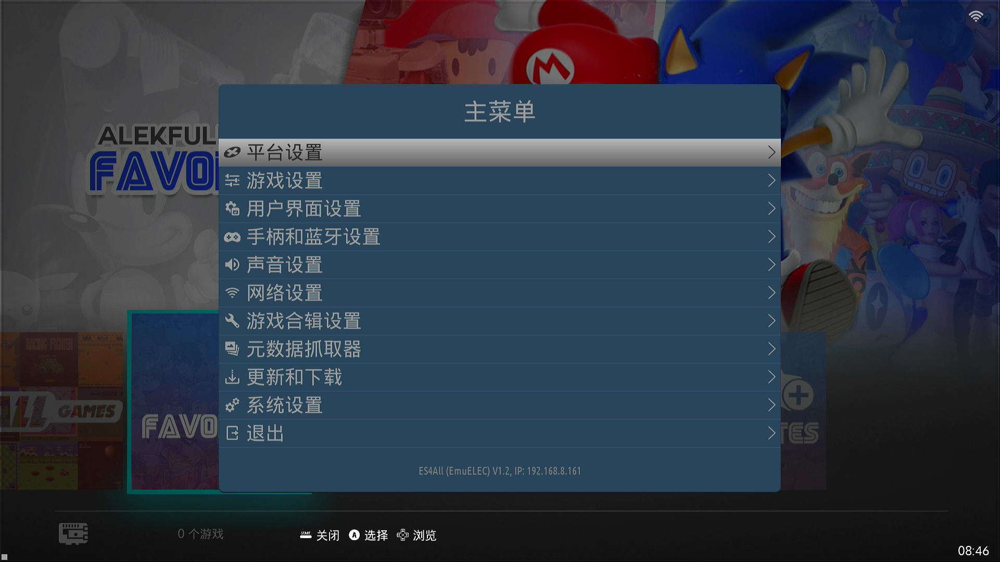

# es4all — EmulationStation for Armbian / ROCKNIX / EmuELEC

<p align="center"></p>

统一维护的 EmulationStation 前端源码。同一份代码、多个 build profile，用
`ES4ALL_TARGET` 切换平台差异，覆盖三个 target：

| target    | 系统            | libc  | init    | 编译方式                         |
|-----------|-----------------|-------|---------|----------------------------------|
| `armbian` | Debian trixie   | glibc | systemd | 直接 CMake（VM bookworm-arm64 chroot） |
| `rocknix` | ROCKNIX         | glibc | systemd | 直接 CMake 出成品，交给发行版直接取用 |
| `emuelec` | EmuELEC         | glibc | systemd | 直接 CMake 出成品，交给发行版直接取用 |

源码基底来自 `es4armbian`（EmuELEC/emuelec-emulationstation 的分化 fork）。
原 es4armbian 的详细改动笔记见 [`README_es4armbian.md`](README_es4armbian.md)。

## 架构：独立编译 + 发行版直接取用成品

es4all 要求**能独立编译**（在 VM bookworm-arm64 chroot 直接用 CMake 编出成品）。
EmuELEC / ROCKNIX 做 userspace 时**不在自己的 buildroot 编源码**，直接取用我们
编好的二进制。三边都是 glibc + aarch64，主要相容性变量是动态库（SDL2/VLC 等）。

## 分歧开关：target → 能力标志

代码**不**直接用 target 名做 `#if`，而是先由 CMake 把 target 翻成一组「能力标志」，
代码只认能力、保留合并机会（例：三边皆 systemd，重启逻辑共用一份）：

```
-DES4ALL_TARGET=armbian|rocknix|emuelec
   → -DES4ALL_TARGET_<NAME>=1
   → -DES4ALL_INIT_SYSTEMD=1        # 三边皆开
   → -DES4ALL_PATHS_<NAME>=1        # 唯一真正三分：配置/ROM/retroarch.cfg 路径
   → -DES4ALL_BUILD_BUILDROOT=1     # rocknix / emuelec
```

三边的实质差异几乎只剩「路径」一个维度（init、libc、渲染 GLES2 皆一致）。

## 目录

- `es-core/` `es-app/` `locale/` … ES 源码本体（跨 target 共用）
- `external/` … 内置依赖（含 vendored pugixml，独立/云编译不依赖系统库或 submodule）
- `dist/armbian/` — 直接 CMake 编，含启动脚本
- `dist/rocknix/` — ROCKNIX 打包胶水（`package.mk` 等）
- `dist/emuelec/` — EmuELEC 打包胶水（`package.mk` 等）

## 编译（armbian，独立编译）

在 VM `bookworm-arm64` chroot：

```bash
cmake -DES4ALL_TARGET=armbian -DGLES=OFF -DGLES2=ON -DENABLE_EMUELEC=1 -DCEC=OFF .
make -j4
```

ROCKNIX / EmuELEC 版同上，改 `-DES4ALL_TARGET=rocknix`（或 `emuelec`）即可。

## 分支与发布

| 分支 | 用途 |
|---|---|
| `v1.3-dev` | **下一版开发线**（待建立：从 `v1.2-stable` 复制出来、不改名） |
| `v1.2-stable` | **当前稳定线**（default）。1.2 已定版发布（tag `v1.2`），1.2 的修正进这里 |
| `v1.1-stable` | 1.1 维护线 |
| `v1.0-stable` | 1.0 维护线 |

> 惯例：开发在 `vX.Y-dev`，定版时**从 dev 复制出 `vX.Y-stable`（不改名）**并把版本字串由
> `X.Ypre` 改为 `X.Y`，CI 於是发出正式版 tag 与 Release，default 分支跟着切到新的 stable。
> `v1.2` 就是这样在 2026-08-04 由 `v1.2-dev` 转正的。

Release 由版本字串（`es-app/src/EmulationStation.h` 的 `PROGRAM_VERSION_STRING`）自动推导：
tag 为 `v<版本>`，含 `pre` 发预览版、不含则发正式版（Latest）。
维护分支带 `-stable` 后缀是因为 `v1.0` / `v1.1` 已被 tag 占用，同名会让 git 报 refname ambiguous。

> 开发分支改名时，**必须同步四处 `PKG_GIT_CLONE_BRANCH`**（本仓库 `dist/{rocknix,emuelec}/package.mk`
> 两份参考副本，以及 `w2xg2022/rocknix` 与 EmuELEC 树里的两份真源），否则固件树 clone 不到分支、
> 编译直接失败。

## 待办（v1.3）

### 1. 视频模式（分辨率切换）

1.1 三个 target 一律移除选单，**后端保留**、接回来即可：

- `rocknix` — glue 脚本 `es4all-setvideomode`（wlr-randr，Wayland）
- `emuelec` — `ApiSystem::applyEmuelecVideoMode()`（解 `/sys/class/display/debug` 锁 + 写完还原 PHY）
- `armbian` — 尚未实作

> ⚠️ 难点在**验证手段**：采集卡本身不重新协商输入时序，切模式后会黑屏/角落/撕裂，
> **看到异常不一定是程式的错**（1.1 期间为此误判过一次）。要嘛接真电视验，
> 要嘛先做好防呆（试用确认对话框那套机制已写过）。

### 2. 「用户界面设置」首次进入即退出时的闪烁

进入「用户界面设置」后不做任何修改、直接按退出键，会有约 0.5 秒的画面闪烁。
尚未定位根因并修复。

### 3. 简体中文、繁体中文翻译精校

部分词条术语/语序未翻译，或在两种译文间不一致，需要逐项校对统一。
