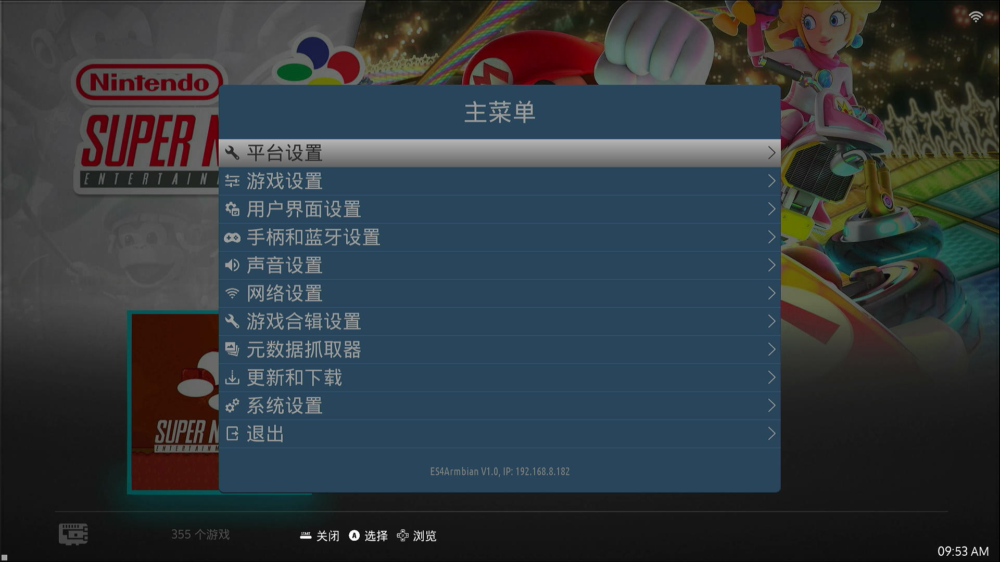

# es4armbian: EmulationStation for Armbian

基于 [EmuELEC EmulationStation](https://github.com/EmuELEC/emuelec-emulationstation) 的二次开发版本，目标是让 EmulationStation 前端可以在 Armbian 系统上独立运行，且简体中文/繁体中文翻译基本可读。




## 1. 仓库来源与定位

- 代码来源：EmuELEC 项目中的 `emulationstation` 子模块（`es-core` / `es-app` / `locale` 等），版本基于 EmuELEC 当前主线。
- 修改目的：EmuELEC 原版 EmulationStation 假设运行在完整的 EmuELEC 系统镜像之上（依赖 `/emulationstation`、`/emuelec/configs/emuelec.conf` 等 EmuELEC 专属路径和服务）。本项目将其移植到标准的Armbian aarch64环境中，作为独立的游戏前端使用，并逐步替换为 es4armbian / EmulationStation for Armbian。
- 设备测试环境：RK3566 MD1000 一体机主板，运行 Armbian（**Debian 13 / trixie**），内核 `6.18.33-ophub`（aarch64）。
- 版本号：以 [`es-app/src/EmulationStation.h`](es-app/src/EmulationStation.h) 中的 `PROGRAM_VERSION_STRING` 为唯一版本来源，会显示在 ES 主菜单（"ES4Armbian Vx.x"），GitHub Release 名称也会自动带上该版本号。

## 2. 主要修改内容

- **编译适配**：必须使用 `-DGLES=OFF -DGLES2=ON -DENABLE_EMUELEC=1 -DCEC=OFF` 编译，否则因头文件/渲染相关宏不匹配导致编译错误。
- **语言切换修复**：`Paths.cpp`/`main.cpp` 改为通过 `Settings`（`~/.emulationstation/es_settings.cfg`）持久化和读取语言设置，使中文等语言可正常切换并在重启后保留。
- **菜单大小写/翻译统一**：`MenuComponent::addEntry` 统一调用 `toUpper`；补全简体/繁体中文数百条缺失词条，统一同一英文术语在不同菜单中的译法。
- **启动/退出画面（Splash）**：实现独立的启动/退出画面开关并支持渲染退出画面，修复两者在「平台设置」中无法保存的问题；Logo 重绘为 es4armbian / ARMBIAN 风格。
- **菜单精简与功能调整**：移除 SSH 开关与 emuelec 专属的「DANGER ZONE」（云备份/强制更新等危险操作）；修正 PLATFORM SETTINGS 图标；网络/蓝牙设定改用 `batocera-wifi`/`batocera-bluetooth`。
- **KMSDRM 模式下游戏无法启动修复**（`FileData.cpp`）：`hideWindow` 在 KMSDRM 模式下沿用 `HideWindow` 设定以释放 DRM master；并在启动游戏前主动扫描关闭 ES 残留的 `/dev/dri` fd，避免 RetroArch 报 `[ERROR] [KMS]: Error when switching mode`。
- **「网络设置」主机名称显示修复**（`ApiSystem.cpp`/`GuiMenu.cpp`）：改用 `gethostname()` 读取系统实际主机名并以只读方式显示，不再提供可编辑的 `system.hostname` 输入框。
- **日志路径修复**（`Paths.cpp`）：`mLogPath` 由不存在的 `/emuelec/logs` 改为 `~/.emulationstation`，修复 `LOG()`/`--debug` 输出因 `fopen()` 失败而被完全跳过的问题。
- **Release 打包修正**：Release 打包脚本（`.github/workflows/build.yml`）修正压缩流程，`emulationstation-armbian-aarch64.zip` 解压后不再多出一层 `emulationstation/` 目录；改用版本化 tag（`v<版本号>`）发布，保留历史版本不再互相覆盖。
- **平台设置图标**：「平台设置」菜单图标由 `iconAdvanced` 改用 `iconEmuelec`（Emuelec 单色剪影，配合主题风格）。
- **手柄 ABXY 方位**：手柄配置界面的 ABXY 标注改为比照实体手柄印刷布局（A=下 / B=右 / X=左 / Y=上），避免「BUTTON A / EAST」与实机按键位置对不上。

## 3. 运行环境（可无需 X11）

- EmulationStation 基于 SDL2 渲染，除了 X11，SDL2 本身也支持 `KMSDRM` / `fbdev` 等视频驱动，理论上可以直接在没有 X 服务器（即 Armbian 的纯 console / `multi-user.target`）的环境下运行，从而减少一层 X11 的资源开销。
- **测试环境**仍然通过 `startx` 启动 Xorg 后再运行 `emulationstation`（`DISPLAY=:0`），主要是为了方便用 `xdotool` / `scrot` 等 X11 工具进行调试和截图验证，**并非运行的硬性要求**。


## 4. 编译方法

### 4.1 编译环境

推荐使用与目标设备同架构（aarch64）的 Docker 容器或 chroot 环境（例如基于 **Debian 13 / trixie**（`arm64v8/debian:trixie`）的容器），避免交叉编译带来的兼容性问题。

### 4.2 获取源码与配置编译

```bash
git clone https://github.com/w2xg2022/es4armbian.git emuelec-es
cd emuelec-es
mkdir -p build && cd build

cmake .. \
  -DGLES=OFF \
  -DGLES2=ON \
  -DCEC=OFF \
  -DENABLE_EMUELEC=1

make -j$(nproc)
```

编译产物：

- `emulationstation2`（可执行文件，部署时建议命名/链接为 `emulationstation`）
- `locale/lang/*/LC_MESSAGES/emulationstation2.mo`（由 `.po` 文件通过 `make i18n` 相关目标生成，约处理 40 种语言，耗时较长）

> 若只修改了 `.cpp` / `.h` 源码（不涉及翻译文件），可以只重新链接相关目标，无需重新跑 i18n。若修改了 `.po` 文件或涉及 es-core 公共组件（如 `MenuComponent.cpp`），需要完整执行一次 `make -j$(nproc)`，耗时约 25-30 分钟。

### 4.3 部署到设备

Release 中的 `emulationstation-armbian-aarch64.zip` 解压后即为 `emulationstation`、`resources/`、`locale/`（打包脚本已修正，不会多出一层 `emulationstation/` 目录）：

```bash
unzip emulationstation-armbian-aarch64.zip -d /opt/emulationstation
```

确保 `/opt/emulationstation/` 下有以下结构：

```bash
/opt/emulationstation/emulationstation        # 可执行文件
/opt/emulationstation/resources/              # 资源文件
/opt/emulationstation/locale/                 # 翻译文件（容易遗漏）
```

并确保安装运行依赖：

```bash
apt-get install -y libsdl2-mixer-2.0-0 polkitd pkexec
```

赋予可执行权限后，以普通用户（如 `game`）启动 `emulationstation` 即可。

## 5. 云端编译（GitHub Actions）

仓库内置 `.github/workflows/build.yml`，推送到 `main` 分支或手动触发（workflow_dispatch）时，会在 `arm64v8/debian:trixie` 容器中以 aarch64 原生方式编译，无需自备 Docker/aarch64 环境：

- 自动安装编译依赖并以 4.2 所述的 `-DGLES=OFF -DGLES2=ON -DCEC=OFF -DENABLE_EMUELEC=1` 参数构建。
- 构建完成后将 `emulationstation`、`resources/`、`locale/` 打包为 `emulationstation-armbian-aarch64.zip`，并发布到 [Releases](../../releases) 的 `latest` 标签，按 4.3 说明覆盖部署即可，无需重新编译。

## 6. 遗留问题

1. **「用户界面设置」首次进入即退出时的闪烁问题**：进入「用户界面设置」后不做任何修改、直接按退出键，会有约 0.5 秒的画面闪烁，尚未定位根因并修复。
2. **简体中文、繁体中文翻译精校**：部分词条术语/语序未翻译，或在两种译文间不一致，需要逐项校对统一。
3. **自动下载安装更新版**：目前更新需手动下载 Release 并按 4.3 步骤覆盖部署，尚未实现应用内自动检测与安装更新。

## 7. 授权 License

本项目沿用上游 EmulationStation / EmuELEC 的 **MIT License**（见 [LICENSE.md](LICENSE.md)，原始版权声明 `Copyright (c) 2014 Alec Lofquist`）。

- 本仓库的所有修改同样以 MIT License 发布，不额外附加限制条款。
- 各第三方库（SDL2、PugiXML、RapidJSON、FreeImage、libcurl、VLC 等）的版权和授权信息见 [CREDITS.md](CREDITS.md)，使用/分发时请一并遵守。
- 原版 EmuELEC EmulationStation 的说明文档保留在 [README_EmuELEC.md](README_EmuELEC.md) 中作为参考。
